# 🎯 Object Detection and Tracking (YOLOv8 + Deep SORT)

This project is a real-time object detection and tracking system built using the Ultralytics YOLOv8 models and Deep SORT tracking. It includes a clean and interactive Streamlit interface with webcam, video, and image input support.

---

## 🚀 Features

- ✅ YOLOv8 Model Variant Selection (`n`, `s`, `m`, `l`, `x`)
- ✅ Webcam, video file, and image input support
- ✅ Deep SORT tracking (toggleable)
- ✅ Real-time FPS counter
- ✅ Class-wise object count summary
- ✅ Filter detection by object classes
- ✅ Confidence threshold control
- ✅ Detection log console
- ✅ Download processed video and CSV summary
- ✅ Fully interactive and professional Streamlit GUI

---

## 📸 Sample Classes Supported

- person
- car
- dog
- cat
- truck
- bicycle
- motorcycle
- bus
- bottle

*(based on COCO dataset classes)*

---

## 🛠️ Technologies Used

- Python
- OpenCV
- Ultralytics YOLOv8
- Deep SORT tracking
- Streamlit

---

## 📂 Project Structure

```
Object-Detection-and-Tracking/
│
├──venv/
├── main.py                  # Streamlit GUI logic
├── detect_and_track.py      # Core detection/tracking logic
├── utils.py                 # Model descriptions and class list
```

---

## ▶️ How to Run

1. **Clone this repository**  
```bash
git clone https://github.com/aryansengar007/Object-Detection-and-Tracking.git
cd Object-Detection-and-Tracking
```

2. **Install dependencies**
```bash
pip install -r requirements.txt
```

3. **Download YOLOv8 model weights** (e.g. `yolov8n.pt`)  
From: [https://github.com/ultralytics/ultralytics](https://github.com/ultralytics/ultralytics)


4. **If using virtual environment, activate it**
```bash

venv\Scripts\activate
```
---

5. **Install necessary libraries**
```bash

pip install ultralytics opencv-python deep_sort_realtime streamlit
```
---

6. **Run the app**
```bash

streamlit run main.py
```

---

## 🖥️ Demo Screenshots
 
 # Dashboard 
 [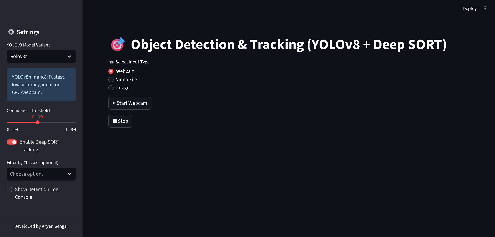](assets/dashboard_1.png)
 [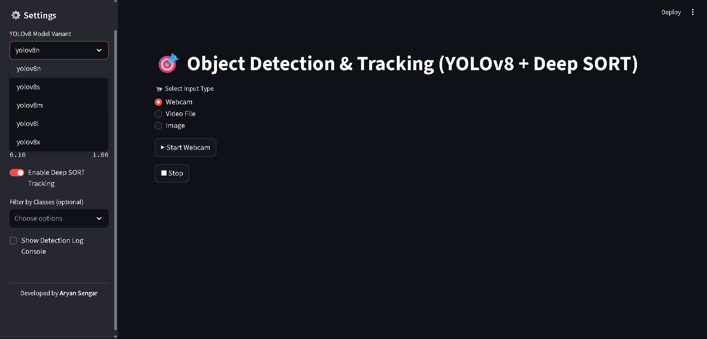](assets/dashboard_2.png)
 [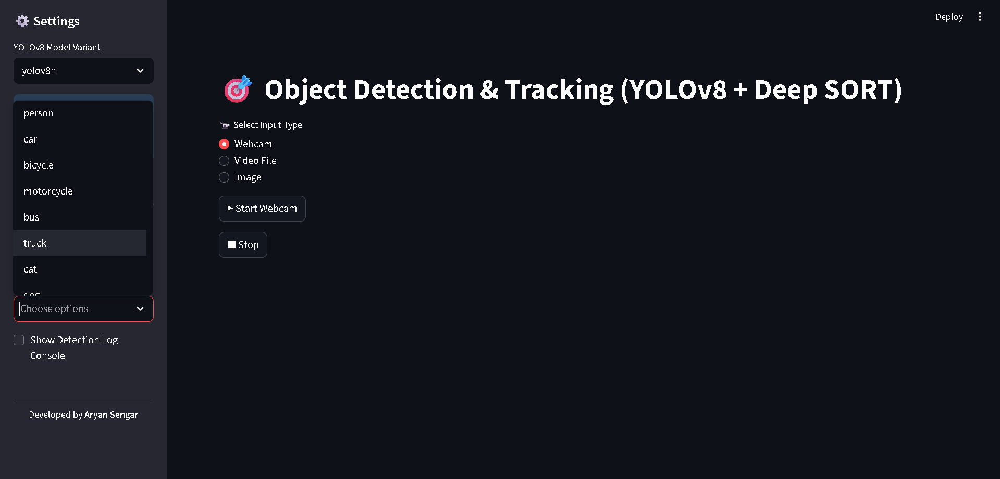](assets/dashboard_3.png)
 [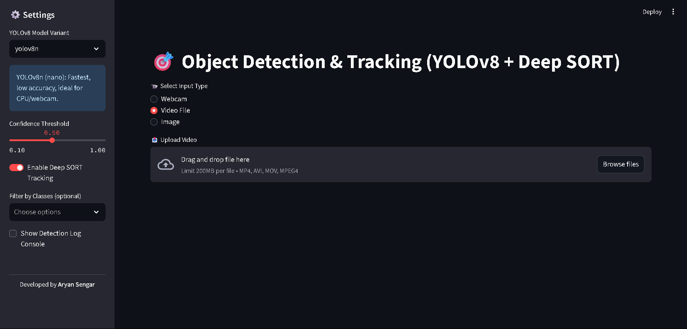](assets/dashboard_4.png)
 [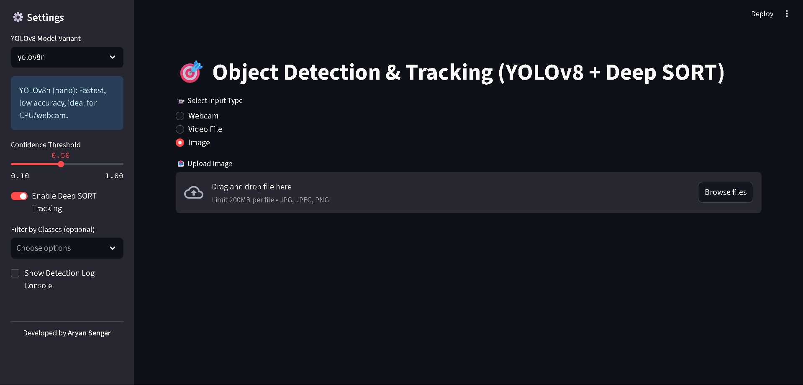](assets/dashboard_5.png)

 # Result
 [](assets/prediction_result_1.png)
 [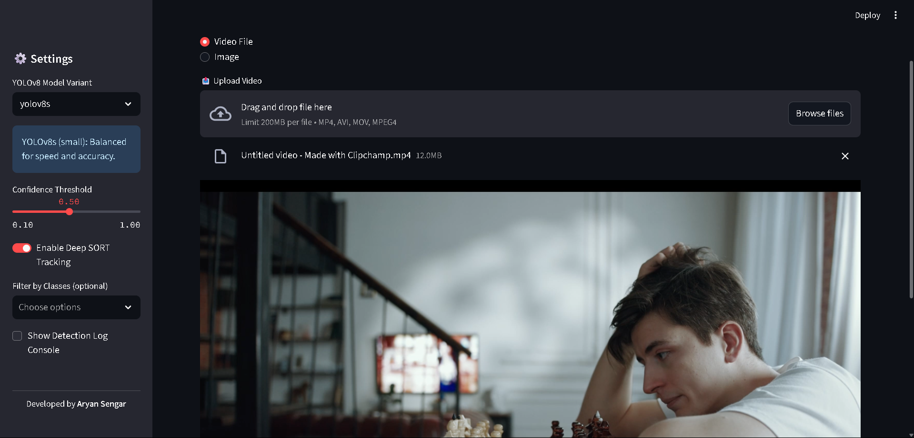](assets/prediction_result_2_2.1.png)
 [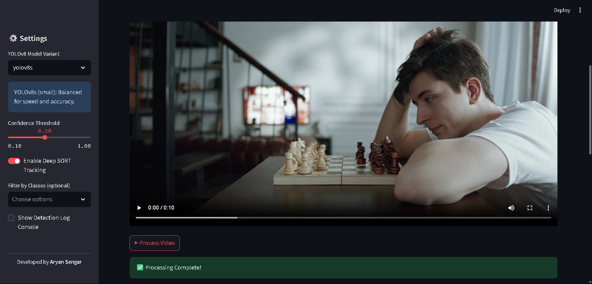](assets/prediction_result_2_2.2.png)
 [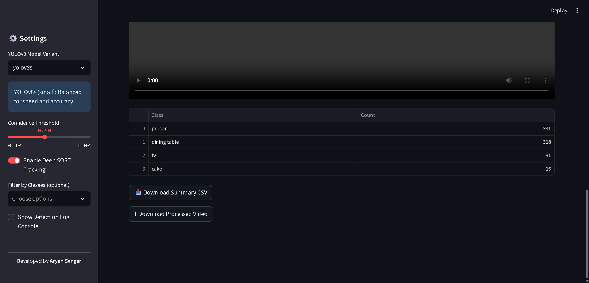](assets/prediction_result_2_2.3.png)
 [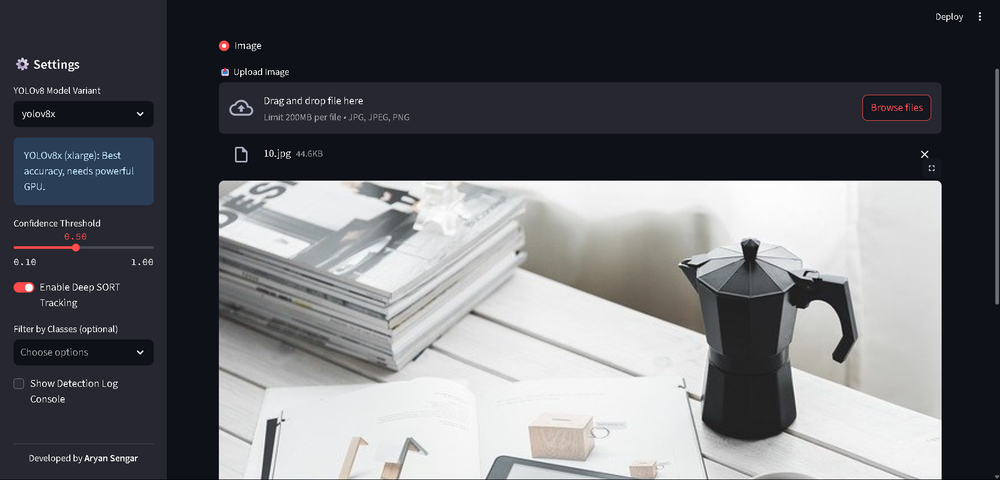](assets/prediction_result_3_3.1.png)
 [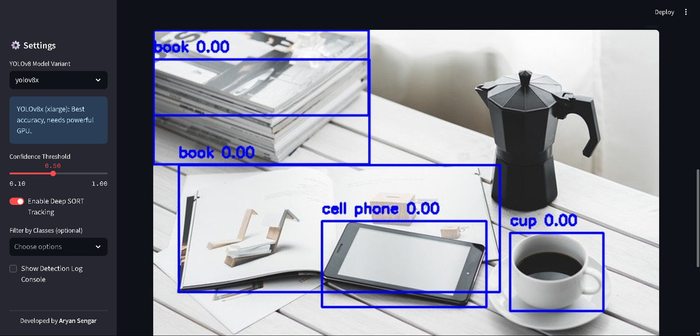](assets/prediction_result_3_3.2.png)
 [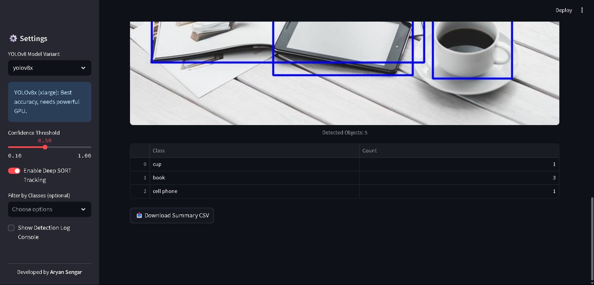](assets/prediction_result_3_3.3.png)

 # Generated File and Video
 [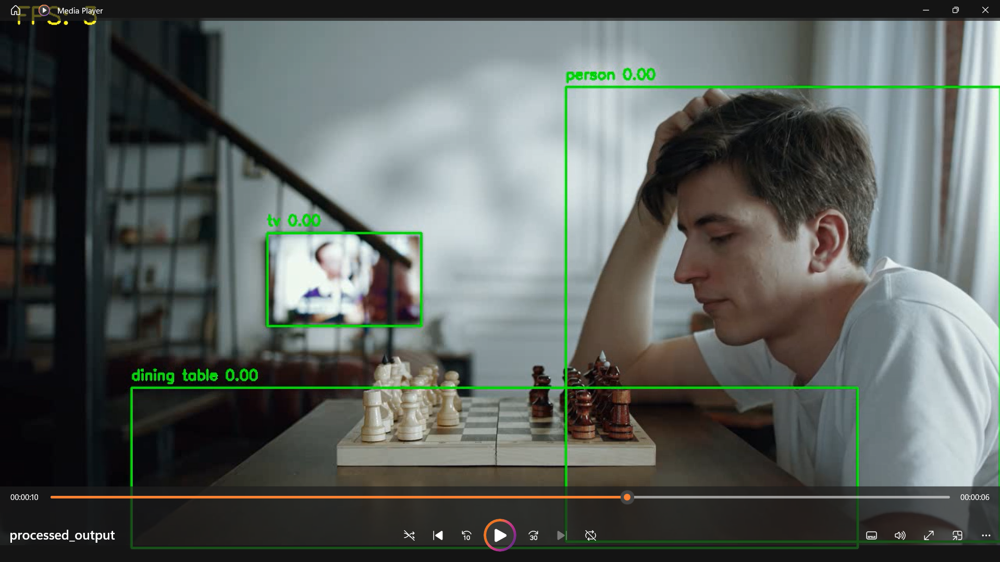](assets/file_preview_1.png)
 [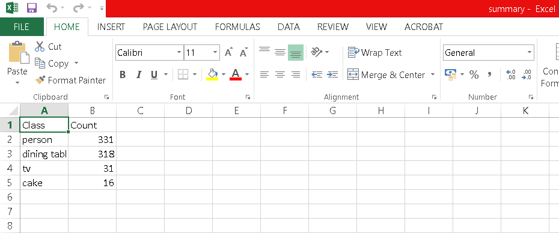](assets/file_preview_2.png)
 [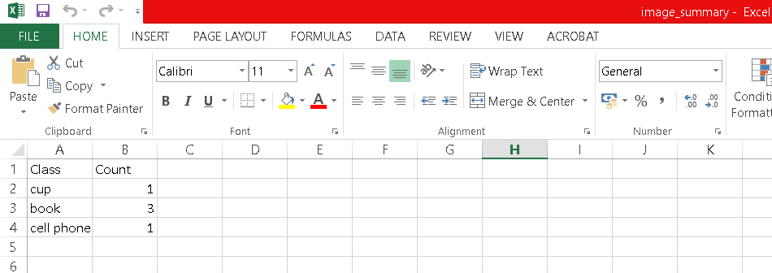](assets/file_preview_3.png)
 
---

## 🙋‍♂️ Developed By

**Aryan Sengar**  
💻 Passionate about AI, Computer Vision, and Intelligent Systems  
📍 Gurgaon, India
